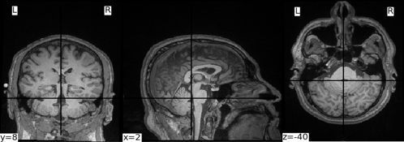

## Schizophrenia Classification from Magnetic Resonance Images

### Overview
This project focuses on exploring the effect of various preprocessing and data augmentation methods on the accuracy of schizophrenia detection from Magnetic Resonance (MR) images. The aim of this exploration is to address the existing ambiguity in how MR images are preprocessed before training, as most authors in literature perform preprocessing in MATLAB without clear instructions for reproducibility.

### Project Data
The raw data were obtained from the [SchizConnect](http://schizconnect.org/) database. The data obtained originates from the Center of Biomedical Research Excellence (COBRE) dataset in NifTI format and represents structural MR images. In the framework of the present study, the data was sampled to give a balanced representation of age and gender distributions in the dataset, prioritizing age distribution, which has been shown to affect model performance. Overall, the project includes data from 62 individuals, 30 with schizophrenia and 32 healthy controls.

Example of the raw data:

<p align="center">
  
</p>

### Project Workflow
[Data Loading](src/utils/data_loader.py) >> [Data Exploration](src/utils/eda.py) >> [Preprocessing](src/utils/preprocess.py) >> [Validating Preprocessing Output](src/utils/preprocess_validation.py) >> [Augmentation](src/utils/augmentations.py) >> [Feature Extraction](src/models/cnn.py) & [Training](src/models/svm.py) >> [Visualizing training results](src/utils/plot_svm_metrics.py)

&check; Data Exploration: assessed demographic features and gender/age distributions;

&check; Preprocessing & Augmentation: experimented with different combinations of preprocessing and data augmentation techniques to determine which pipeline yields the best performance of the ML/DL models;

&check; Feature Extraction & Training: harnessed ResNet-18 to extract features and SVC to classify them;

&check; Visualizing: obtained classifier metrics and compared results across experiments.

#### Definitions and specifications

Parameters

### Repository Structure
```.
|   .gitignore
|   pyproject.toml              -> Build requirements and deppendencies 
|   README.md                   -> Project description and file structure
|   schizo.code-workspace       -> Workspace settings
|   tox.ini                     -> Test automation
|
+---src
|   |   logger.py               -> Track errors and debugging information
|   |   main.py                 -> Main project logic and entrypoint
|   |   __init__.py
|   |
|   +---models
|   |       cnn.py              -> Architecture for feature extraction
|   |       svm.py              -> Support vector classifier
|   |       __init__.py
|   |
|   +---paper
|   |   |   paper.bib           -> Formatting report citations
|   |   |   paper.pdf           -> Actual report in PDF format
|   |   |   paper.tex           -> LaTeX source document for report
|   |   |   preamble.tex        -> LaTeX source document for report
|   |   |   supplementary_figures.pdf -> Visualizations of EDA and training results
|   |   |
|   |   \---figs
|   |           brain_extraction_image.png  -> MRI slice after brain extraction
|   |           eval_final_model.png        -> Visualization of final training results
|   |           metrics_comparison.png      -> Plot of metrics comparison across all experiments
|   |           model_architecture.png      -> Project workflow and model architecture
|   |           raw_image.png               -> Unprocessed MRI slice
|   |           sample_volume.png           -> Plot of 3D MRI volume in 2D
|   |           slice_comparison.png        -> MRI slice comparison before and after preprocessing
|   |
|   \---utils
|       |   augment_images.py       -> Main script for performing specified augmentations
|       |   augmentations.py        -> Functions for data augmentation
|       |   classifier.py           -> Main image classification script
|       |   data_loader.py          -> Data loading
|       |   dataset_preparation.py  -> Split raw data into training and test sets to prevent data leakage
|       |   eda.py                  -> Exploratory data analysis on clinical data
|       |   feature_extractor.py    -> Feature extraction with ResNet18
|       |   plot_svm_metrics.py     -> Plot confusion matrices and ROC curves for SVC and compare training metrics
|       |   preprocess_validation.py-> Validate teh output of preprocessing techniques
|       |   preprocess.py           -> Functions for data preprocessing
|       |   preprocessing.py        -> Main script for performing specified preprocessing operations
|       |   __init__.py
|       |
|       \---__pycache__
|               __init__.cpython-312.pyc
|
+---tests
|       test_augmentations.py        -> Test for augmentation pipeline
|       test_data_loader.py          -> Test for data loading
|       test_preprocess.py           -> Test for preprocessing pipeline
|       __init__.py
|
\---tools
        convert_nii_pt.py             -> Tool to convert images from .nii to .pt
```


## References
We did not replicate a specific paper, but information from the following paper were referenced in the final report:  
1) Gengeç Benli, Ş., & Andaç, M. (2023). Constructing the schizophrenia recognition method employing GLCM features from multiple brain regions and machine learning techniques. Diagnostics, 13(13), 2140.
2) Harestad, O. A. (2024). Sub-grouping Schizophrenia Spectrum Disorders using Deep Learning on Resting State fMRI (Master's thesis, The University of Bergen).
3) Joyee, R. F., Rodoshi, L. H., & Nadia, Y. (2023). Application of deep learning in MRI classification of Schizophrenia (Doctoral dissertation, Brac University).
4) Oh, J., Oh, B. L., Lee, K. U., Chae, J. H., & Yun, K. (2020). Identifying schizophrenia using structural MRI with a deep learning algorithm. Frontiers in psychiatry, 11, 16.
5) Teskera, T., & Bozek, J. (2023, September). Schizophrenia Detection from Resting State Functional MR Images Using Machine Learning. In 2023 International Symposium ELMAR (pp. 87-90). IEEE.


## Instructions to run the project:
All command should run under project root/working-directory
```bash 
# install Virtualenv is - a tool to set up your Python environments
pip install virtualenv
# create virtual environment (serve only this project):
python -m venv venv
# activate virtual environment
venv\Scripts\activate # Windows
source venv/bin/activate # Linux
+ (venv) should appear as prefix to all command (run next command just after activating venv)
# update venv's python package-installer (pip) to its latest version
python.exe -m pip install --upgrade pip
# install projects packages (Everything needed to run the project)
pip install -e .
# install dev packages (Additional packages for linting, testing and other developer tools)
pip install -e .[dev]
# specify the project configuration: edit the config file and save the configuration
nano config.yaml
# run the main script
python main.py
``` 